# Notice Management Flowcharts

This document breaks the Notice Management module into smaller diagrams based on the current frontend repo and the backend repo `UlinkWeb_backend`.

Verified source files:

- `src/views/backstage/notice/notice.vue`
- `src/views/backstage/notice/components/addNotice/addNotice.vue`
- `src/apis/backstage/notice.ts`
- `src/views/foreground/news/news.vue`
- `src/views/foreground/home/home.vue`
- `/Users/milescai/PycharmProjects/UlinkWeb_backend/admin_role/urls.py`
- `/Users/milescai/PycharmProjects/UlinkWeb_backend/admin_role/views.py`
- `/Users/milescai/PycharmProjects/UlinkWeb_backend/admin_role/service.py`
- `/Users/milescai/PycharmProjects/UlinkWeb_backend/admin_role/models.py`
- `/Users/milescai/PycharmProjects/UlinkWeb_backend/admin_role/autoNotify.py`

Important scope note:

- The frontend and backend notice flows are both verified now.
- The only thing not fully represented here is database data itself and runtime deployment behavior.

## Quick Legend

- `待发布`: created but not yet visible on the frontend
- `已发布`: visible on the frontend
- `已撤回`: previously published, then removed from frontend display
- `About`: homepage About section cards
- `News`: news page list/cards

## Best Subset If You Want Fewer Images

If your Google Doc should stay very clear, use these 8 figures first:

1. Overall module structure
2. Admin list and select notices
3. Add notice: frontend form
4. Add notice: backend creation
5. Edit notice: backend status rules
6. Publish notice
7. Frontend News page rendering
8. Frontend About page slot rendering

## Recommended Order For Your Google Doc

1. Overall module structure
2. Admin list and select notices
3. Add notice: frontend form
4. Add notice: backend creation
5. Edit notice: frontend submit
6. Edit notice: backend status rules
7. Publish notice
8. Revoke notice
9. Delete notice
10. Backend auto-publish flow
11. Frontend News page rendering
12. Frontend About page slot rendering

## 1. Overall Module Structure

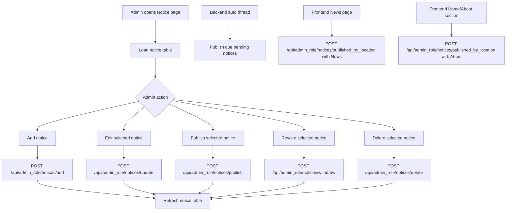

## 2. Admin List And Select Notices

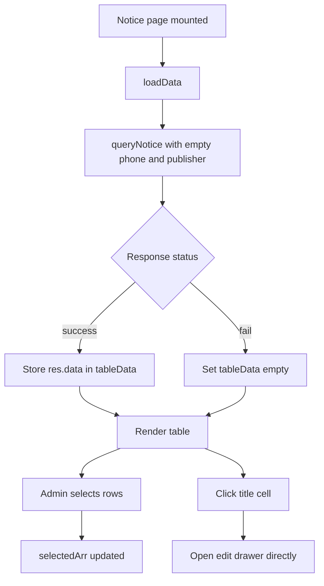

Key meaning:

- This page currently loads all notices directly.
- The search button exists in UI structure, but actual filter inputs are not implemented in this file.
- Clicking a title opens edit mode immediately.
- The frontend uses `queryNotice`, which maps to backend `query_notice`, not backend `notice_list`.
- `query_notice` requires a valid admin token and supports filtering by `publisher` and `phone`.

## 3. Add Notice: Frontend Form

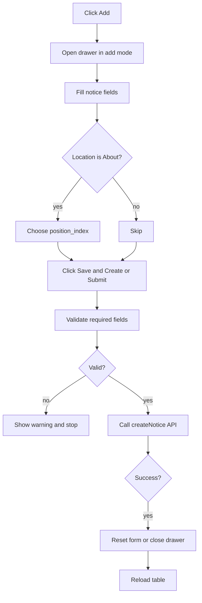

Field rules that are clearly visible in code:

- Cover image is required.
- Title is required.
- Subtitle is required.
- Publish location is required.
- `position_index` is required only when `publish_location === "About"`.
- Backend default status is `待发布`.
- Backend accepts only `About` or `News` as `publish_location`.
- Backend does not enforce `position_index` for `About`; that rule currently exists only in the frontend.
- Cover upload happens before submit and stores the returned URL in `cover_url`.

## 4. Add Notice: Backend Creation

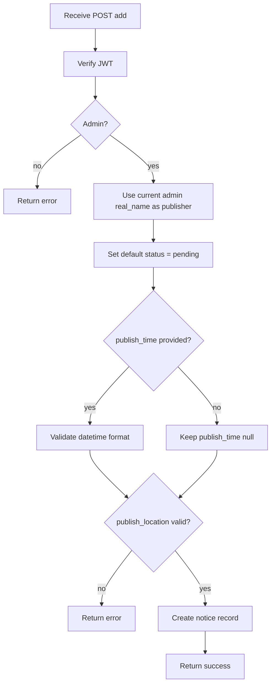

## 5. Edit Notice: Frontend Submit

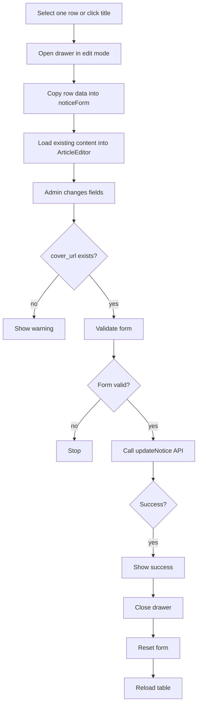

Important current-code note:

- The backend really does have status-based edit restrictions.
- If a notice is already `已发布`, backend keeps the original `publish_time` and `publish_location`.
- If a notice is `待发布` or `已撤回`, backend allows changing `publish_time` and `publish_location`.
- The edit flow still does not separately validate `About` position index before update.

## 6. Edit Notice: Backend Status Rules

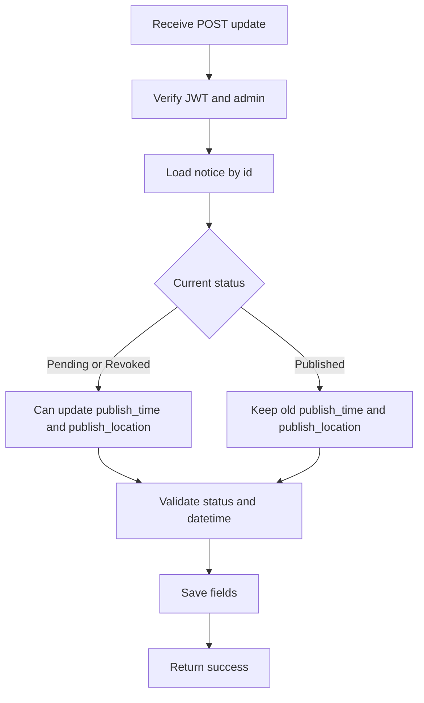

## 7. Publish Notice

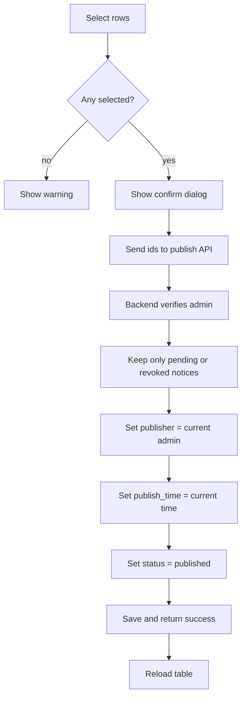

Important current-code note:

- `publishNotice` checks for empty selection.
- `revokeNotice` currently does not check for empty selection before opening the confirm dialog.
- The `displayPosition` dialog component exists in the repo, but it is not used by `publishNotice`.
- Backend `publish_notice` only publishes notices currently in `待发布` or `已撤回`.
- Manual publish ignores any scheduled `publish_time` and replaces it with the current backend time.

## 8. Revoke Notice

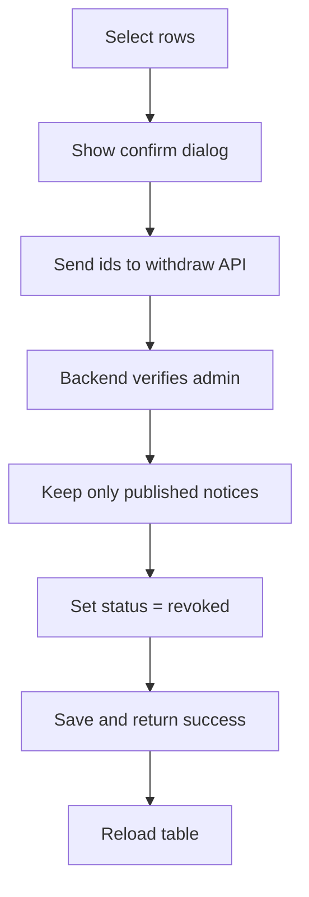

## 9. Delete Notice

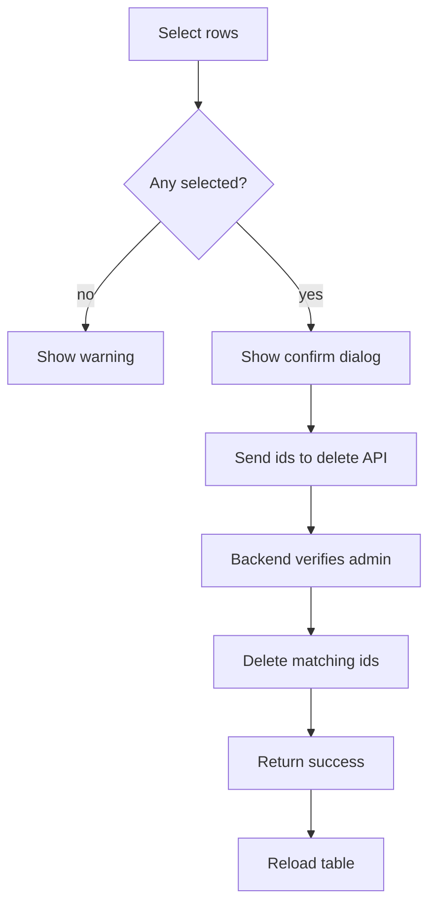

## 10. Backend Auto-Publish Flow

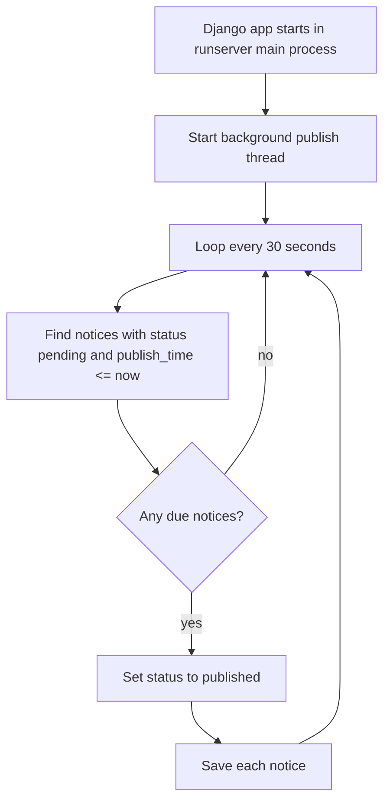

Important backend note:

- This is separate from manual publish.
- Auto-publish changes status to `已发布`.
- Auto-publish does not overwrite `publisher`, `user_id`, or `publish_time` the way manual publish does.

## 11. Frontend News Page Rendering

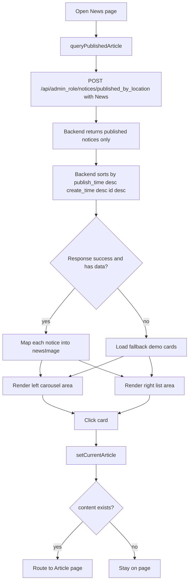

Important current-code note:

- Backend already returns News notices in descending order.
- The left and right columns both loop over the same `newsImage` array.
- The code does not currently split notices into two different groups.
- The code also does not currently sort one side descending and the other side ascending.

## 12. Frontend About Page Slot Rendering

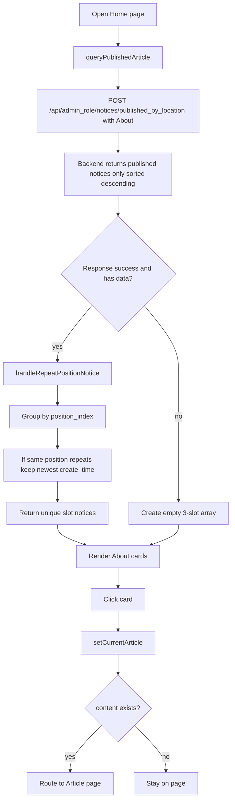

This one is useful because it explains why `position_index` exists only for `About`.

## Current Code Findings You May Want To Mention In The Doc

1. Add, query, update, delete, publish, and revoke all have backend logic verified in `UlinkWeb_backend`.
2. The admin table currently loads all notices by calling `queryNotice` with empty `phone` and `publisher`.
3. Manual publish only works for notices in `待发布` or `已撤回`.
4. Revoke only works for notices in `已发布`.
5. Backend also supports timed auto-publish for `待发布` notices whose `publish_time` has arrived.
6. Manual publish overwrites `publish_time` with the current backend time, so scheduled time is ignored in that path.
7. The `displayPosition` component looks like an unfinished or unused publish-position dialog.
8. The News page currently renders the same fetched dataset on both left and right sides.
9. The News page does not yet implement one ascending column plus one descending column.
10. `published_by_location` is open to the frontend without auth, while admin notice operations require backend token validation.

## Suggested Section Titles For Your Google Doc

- Notice Management Module Overview
- Notice List Retrieval Flow
- Notice Creation Flow
- Notice Creation Backend Flow
- Notice Editing Flow
- Notice Editing Backend Rules
- Notice Publish Flow
- Notice Revoke Flow
- Notice Delete Flow
- Notice Auto-Publish Flow
- News Page Display Flow
- About Section Slot Allocation Flow
